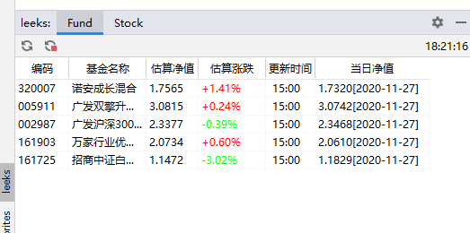
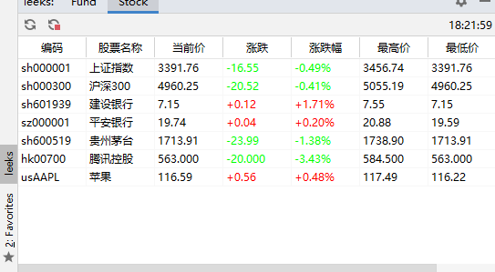

# leeks

idea插件，查看基金，股票：支持A股，港股，美股  

## 请先阅读完readme，确保编码正确输入  
提issues附上:使用的插件版本、IDEA详细的版本信息(到Help->about里面复制出来)，如果【Event Log】有异常信息，也请在issues附上异常  

## 安装   
[插件下载地址](https://github.com/huage2580/leeks/releases)  
找到 leeks-x.x.x.zip 下载后，直接在IDEA里面安装（安装方式自行百度），注意：直接选择zip文件安装，不要解压。  

## 使用  
设置里面找到Leeks选项，输入基金编码，股票编码，英文分号分割【;】，apply。    
可以输入成本价和持有份额，估算收益和收益率，编码后通过英文逗号【,】拼接成本价和份额即可。  

`隐蔽模式默认开启，开启无着色，并且拼音显示，可以自行关闭。`    

基金示例：`006250,3.66,1000;110013;`  
股票示例：`sh000001;sh000300;sh600111,55.7,500;hk00700;usAAPL;usBILI`  
加密货币示例：`BTC-USD,DOGE-USD`  
  
**股票编码有前缀**，示例代码：（sh000001;sh600519;sz000001;hk00700;usAAPL）`股票编码前缀小写`，建议用雪球看网页找    
  
基金编码zfb上面有，或者天天基金看  
  
double shift，连按两下shift，输入leeks，找到toolWindow，打开以后默认在下方，自行调节位置  
每次修改，添加基金,股票，只需点击apply自动生效。    
基金更新频率一分钟一次，股票10s一次  
### 加密货币的选项
加密货币行情采用雅虎的接口，必须使用代理才能获取数据，编码格式如下:  
例:`比特币`货币的编码为`BTC-USD`,【加密货币代码-USD】  

### 分时图和K线图  
基金只有估值分时图，股票提供分时图，日周月K线图，非图表，不能进行操作，不会自动刷新。  
在表格中双击行即可打开分时图，右键弹出菜单选择K线图。  

### 代理  
插件不会使用系统或者IDEA的代理，请前往插件设置页设置代理。格式为`127.0.0.1:1080` 这样子。K线图那些不会走代理  

## 预览

  

## 常见问题
* 异常日志中出现【java.lang.NoClassDefFoundError: com/github/promeg/pinyinhelper/Pinyin】  
  解决：请直接选择【编译后的zip文件】进行安装，不要解压zip文件。
* 股票数据内容显示都是符号【-】  
  解决：确保填写的股票数据格式不正确，有小写前缀。示例（sh000001;sh600519;sz000001;hk00700;usAAPL）

## change  
- v1.1   
增加了股票的tab，采用腾讯的行情接口，股票轮询间隔10s  
- v1.2   
支持了港股和美股 示例代码：（sh000001,sh600519,sz000001,hk00700,usAAPL）代码一般可以在各网页端看得到  
- v1.3    
插件由小韭菜更名为Leeks
支持了IDEA 2020.1.3,兼容到`IDEA 2017.3`，修复macOS 行高问题 
- v1.4.1   
增加了隐蔽模式（全拼音和无色涨跌幅
- v1.4.2  
支持到IDEA 2020.2.*
- v1.5.1  
增加了股票界面按表头排序，设置界面及时生效，不用点击refresh按钮啦  merge from [dengerYang](https://github.com/dengerYang)  
- v1.5.2  
增加了股票的最高价最低价 . merge from [dengerYang](https://github.com/dengerYang) 
- v1.6.1  
样式和bug fix,(样式调整，增加当日净值merge from [dengerYang](https://github.com/dengerYang) )      
- v1.6.2  
适配IDEA 2020.3  
- v1.6.3  
修复颜色错乱问题 , 日志调整 merge from [qwn3213](https://github.com/qwn3213)  
- v1.7.1  
增加日志开关 ,设置界面样式调整 merge from [dengerYang](https://github.com/dengerYang) ，增加新浪股票接口备选 merge from [JulianXG](https://github.com/JulianXG)  
- v1.8.1  
增加了虚拟货币的界面  
- v1.8.3  
增加了分时图和K线图 merge from [dengerYang](https://github.com/dengerYang)  
- V1.8.4  
bug fix from [DAIE](https://github.com/DA1Y1)  
- V1.8.5  
保存表头顺序 from [DAIE](https://github.com/DA1Y1)  
- V1.9.1  
图表界面优化 from [dengerYang](https://github.com/dengerYang)  
- V1.9.3  
加入代理设置  
- V1.9.5  
虚拟币行情接口切换为雅虎，必须使用代理才能获取数据  
- V1.9.8  
支持基金和股票成本价，持仓，收益率，收益显示 from [chenheng](https://github.com/RoaringFlame)  
- V1.9.9  
修复成本价过低时收益金额不正确的问题；from [神驱一梦](https://github.com/BorrisWQBi)    

